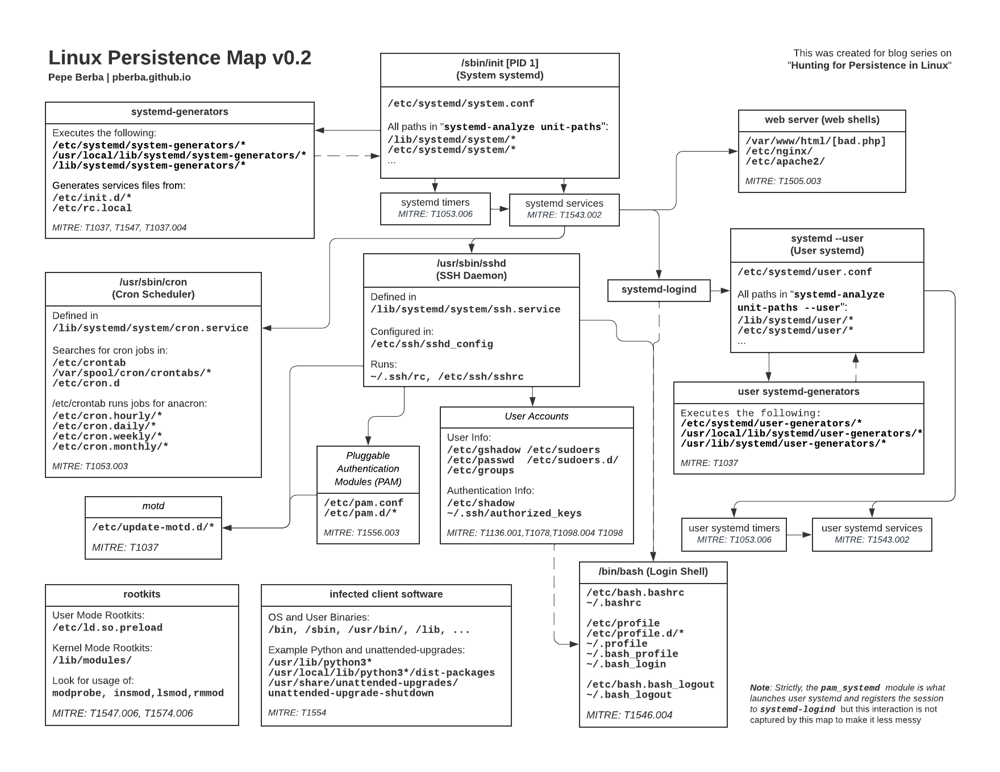

# Indicators of Compromise (IoC) - Manual quick checks
1. [System Infos and Settings](#system-info-and-settings)
. [Users, User Groups and Authentication (SSH)](#users-user-groups-and-authentication-ssh)
. [Files, Directories and Binaries](#files-directories-and-binaries)
. [System Logs](#system-logs)
. [Processes](#processes)
. [Persistence, overview](#persistence-overview)
. [Privilege Escalation, overview](#privilege-escalation-overview)
. [Usefull Velociraptor artifacts](#useful-velociraptor-artifacts)
. [Useful Linux Commands](#useful-linux-commands)
- Shells

## System Infos and Settings
## Users, User Groups and Authentication (SSH)
**`/etc/passwd`**,  **`/etc/shadow`**
- new user accounts
- only `root` can have UID 0
- suspicious home directories, for example hidden: `~/.hiddendir`
- login shell (service users must have `nologin` or `false`)  
- check for password hashes inside `/etc/shadow` for users without a shell

**`/etc/group`**  
- lists groups and members

**Logins**  
Search for suspicious logins or failed attempts.  
- `#last`: last successful logins
- `#lastb`: last failed login
- `#lastlog`: list last login for all users
- `#utmpdump /var/run/utmp`: all current logins, check type (0 is not valid)
- `#utmpdump /var/log/btmp`: raw dump of btmp (possible to find pw, if a user accidentaly typed pw at the user login prompt)
- if login from a service user → check `nologin` or `false` binary integrity

**SSH Keys**  
Check for suspicious authorized keys, unprotected private keys, suspicous SSH configs, suspicious creation/modification timestamps.  
- `~/.ssh/`: private keys
- `~/.ssh/authorized_keys`: authorized keys file (check for user email address)
- `~/.ssh/known_hosts`: list of hosts accessed previously
- `/etc/ssh/ssh_config`, `/etc/ssh/ssh_config.d`, `~/.ssh/config`: ssh client config
- if a private key is not encrypted → recommended to revoque it

**Useful Velociraptor Artifacts**
- `Linux.Sys.Users`: retrieve Users
- `Linux.Users.RootUsers`: retrieve Users in *sudo* Group
- `Linux.Sys.LastUserLogin`: retrieve wtmp file content (successful logins and logouts)
- `Linux.Users.InteractiveUsers`: retrieve the interactive users (shell login)
- `Linux.Ssh.AuthorizedKeys`: retrieve authorized SSH keys
- `Linux.Ssh.PrivateKeys`: retrieve private keys + checks if encrypted or not
## Files, Directories and Binaries
Search for suspicious files, directories and creation/modification timestamps.
- suspicious Directories:  
  - tries to look like a system directory
  - hidden in system areas
  - weird permissions, attributes (immutable?), timestamp
  - comparison with duplicate VM does not match
- suspicious Files:
  - displayed type (name) not matching real file type
  - modified system binary
  - binary in strange location
  - high entropy (file is encrypted)
- hidden files or directories starting with `.`, `..`, `...`
- `/tmp`, `/var/tmp`, `/dev/shm`: world-writable directories (often used to drop malicious files)
- `#ls -lap`: lists element with a / at the end (allows to see empty spaces)
- `#lsattr`: list attributes of a File or Dir (see if immutable flag is set)
- `#file /path/to/file`: basic file summary
- `#ldd /path/to/binary`: **! never run on a suspicious binary (could execute malicious code) !** lists shared objects
- `#objdump -p /path/to/binary | grep NEEDED`: lists required shared objects
- `#strings /path/to/bianary`: search for suspicious content like `listen()`, `bind()` and/or `accept()`, IP addresses, etc.
- `#find /<dir> -perm 4000`: look for suspicious *setuid* files
- `#find -nouser` `#find -nogroup`: files without assigned UID/GID (may indicate deleted user/group)

**Useful Velociraptor Artifacts**
- `Linux.Detection.AnomalousFiles`: hidden, large or SUID bit set
- `Exchange.Linux.Detection.IncorrectPermissions`: verify files/dirs and checks whether they have the expected owner, group owner and mode.
- [IDEA]: artifact to detect high entropy files (means the file is encrypted → suspicious)
## System Logs
## Processes
## Persistence, overview

### Persistence techniques (non exhaustive list)
#### User Accounts, Authentication
1. **User Accounts and Groups**  
[See](#users-user-groups-and-authentication-ssh)
2. **SSH Keys**  
[See](#users-user-groups-and-authentication-ssh)
3. **MOTD**  
Message of the day (MOTD) is a message presented to a user when he/she connects via SSH or a serial connection.
If activated, MOTD scripts are executed as `root` every time a user connects to a Linux system.
These scripts can be modified to gain persistence.
Config files in `/etc/update-motd.d/`
4. **XDG Autostart**  
XDG Autostart entries can be used to execute arbitrary commands or scripts when a user logs in.  
System-wide configs: `/etc/xdg/autostart/`, `/usr/share/autostart/`  
User-specific configs: `~/.config/autostart/`, `~/.local/share/autostart/`, `~/.config/autostart-scripts/`  
Root-specific configs: `/root/.config/autostart/`, `/root/.local/share/autostart/`, `/root/.config/autostart-scripts/`  
#### System boot: Sytem V, Upstart, Systemd, Run Control
Different scripts are run during system boot. These scripts can be created or modified to gain persistence.  
1. **System V (SysV)**  
Older init system.  
Startup, running and shutdown scripts in `/etc/init.d/` and executed as `root` on boot.  
Scripts are often linked to runlevel directories, determining when they are run: `/etc/rc0.d/`, `/etc/rc1.d/`,`/etc/rc2.d/`, etc.  
2. **Upstart**  
Older init system.
System-wide scripts in `/etc/init/`.  
User-session mode scripts in `~/.config/upstart/`, `~/.init/`,`/etc/xdg/upstart/`,`/usr/share/upstart/sessions/`.
3. **Systemd**  
System ans service manager for Linux, replacement for SysVinit. Systemd operates with `unit files`, defing how services are started, stopped or managed.  
There are different types of `unit files`: `Service` (for managing long-running processes - typically deamons), `Timer` (similar to cron jobs).  
- **Systemd Services**  
System-wide services: `/run/systemd/system/`, `/etc/systemd/system/`, `/etc/systemd/user/`, `/usr/local/lib/systemd/system/`, `/lib/systemd/system/`, `/usr/lib/systemd/system/`, `/usr/lib/systemd/user/`  
User-specific services: `~/.config/systemd/user/`, `~/.local/share/systemd/user/`
- **Systemd Timers**  
Each `.timer`file must have a corresponding `.service` file with the same name.
System-wide timers: `/etc/systemd/system/`, `/usr/lib/systemd/system`,
User-specific timers: `~/.config/systemd/`  
- **Systemd Generator**  
System-wide generators: `/etc/systemd/system-generators/`. `/usr/local/lib/systemd/system-generators/`. `/lib/systemd/system-generators/`. `/etc/systemd/user-generators/`. `/usr/local/lib/systemd/user-generators/`. `/usr/lib/systemd/user-generators/`  
`systemd-rc-local-generator`, `rc-local.service`: Compatibility generator and service to start `/etc/rc.local` during boot.
4. **rc.common, rc.local**  
Config file `/etc/rc.local`

Default artifact: Linux.Sys.Services
#### Jobs, Crons, Timers, Automated actions  
1. **At job** (one time jobs)  
Config files in `/var/spool/cron/atjobs/`  
Job detail in `/var/spool/cron/atspool/`  
2. **Cron Job** (recuring jobs)  
User-specifc cron job settings:  
`/var/spool/cron/`, `/var/spool/cron/crontabs/`  
System-wide cron job settings:  
`/etc/crontab`, `/etc/cron.d/`, `/etc/cron.daily/`, `/etc/cron.hourly/`, `/etc/cron.monthly/`, `/etc/cron.weekly/`  
3. **UDEV**  
Device manager for the Linux kernel. When a device is added to the system (USB drive, keyboard or network interface, etc) UDEV triggers predefined actions (rules).  
These rules can be created or manipulated to gain persistence.
UDEV rule files in:  
`/etc/udev/rules.d/`, `/run/udev/rules.d/`, `/usr/lib/udev/rules.d/`, `/usr/local/lib/udev/rules.d/`, `/lib/udev/`
5. Additionnal persistence mechanisms: `Anacron`, `Fcron`, `Task Spooler`, `Batch`.

Default artifact: Linux.Sys.Crontab
Or with custom artifact: Linux.Collection.Autoruns
#### System tools and configs
1. [Shell Configuration Modification](#shell-configuration-modification)
2. [Dynamic Linker Hijacking](#dynamic-linker) (check if correct here)
3. [Shared object Library](#shared-object-library) (check if correct here)
4. [Startup file](#startup-file)
5. [SUID](#suid) (check if correct here)
6. [System Call](#system-call)
7. Hooks [APT Backdooring]
8 . Shells? (Bind shell in the background; Shell profile)
9. Capabilities?
10. Hooks (Git, DPKG/RPM)
11. Packet managers (APT/YUM/DNF)
12. System binary wrapping for persistence ?
#### Living of the Land Binaries
1. GTFOBins [GTFOBins Reverse Shell](#gtfobins-reverse-shell)
2. Modified system binaries (false)
3. Docker container with host escape
#### Third party tools, scripts
1. [Trap](#trap)
The trap command can catch signals and execute a specified command or set of commands when a signal is received.
Common signals include SIGINT (interrupt, typically sent by pressing Ctrl+C), SIGTERM (termination signal), and EXIT
(when the script exits normally or through one of the signals).
2. Hooks [Git Backdooring]
#### Rootkits, User-Space and Kernel-Space
[Rootkits] (#rootkits) 
"initramfs"  
## Privilege Escalation, overview
## Useful Velociraptor Artifacts
- Linux.Detection.Yara.Process
- Linux.Search.FileFinder

To Do:
- test artifact in other distro:
   - Linux.Collection.CatScale
   - Exchange.Linux.Detection.IncorrectPermissions/Discrepancies
- create artifact for Shell Configuration files
- test ssh bruteforce and check logs
## Useful Linux Commands

## ++++++++++++++++++++++++++++Clean END++++++++++++++++++++++++++++++++++++++++++++++++++
- environment variables and can be set to execute arbitrary commands whenever an action is about to take place like git log and its
- respective environment variable, GIT_PAGER
- [Web Shell](#web-shell) (webserver dir)

## Shared object Library
To Check:
- Env virable LD_PRELOAD in /etc/profile or a script in /etc/profile.d/
- File /etc/ld.so.preload
- Otherwise, inspect individual processes
- Use tools like chkrootkit and rkhunter to scan for rootkits and suspicious files.

## Startup file
Commonly targeted files include ~/.bashrc, ~/.profile, or ~/.bash_profile

## APT Backdooring
APT hook files in /etc/apt/apt.conf.d/

## Git Backdooring
### Hook
Hook files in /.git/hooks/
### Config
Config file in /.git/config (global) and in each project in ~/.git/config

## PAM
Check files in /lib64/security/

## GTFOBins Reverse Shell
See https://gtfobins.github.io/#+shell

## Web shell
### Apache Tomcat webserver - vulnerable manager application
https://github.com/mgeeky/tomcatWarDeployer  
malicious war file dropped in /webapps/ dir.  
sh spawned by a java proces

## Privilege Escalation, overview
1. [Processes Privilege Escalation](#processes-privilege-escalation)
2. [Linux Kernel Vulnerability](#linux-kernel-vulnerability)

## Processes Privilege Escalation
**Detection with Velociraptor**  
Artifact: Exchange.Linux.PrivilegeEscalationDetection
### CVE-2021-4034
Polkit vulnerability, with `pkexec` commmand.  
**Detection with Velociraptor**  
Artifact: Exchange.Linux.Detection.CVE20214034

## Shell
keygen command (lateral movement)

************************************************************
## Shell Configuration Modification

| Files | Working |
|-------|---------|
| /etc/bash.bashrc | systemwide files executed at the start of interactive shell |
| /etc/bash_logout | Systemwide files executed when we terminate the shell |
| ~/.bashrc	| Widly exploited user specific startup script executed at the start of shell |
| ~/.bash_profile, ~/.bash_login, ~/.profile | User specific files , but which found first are executed first |
| ~.bash_logout | User specific files, executed when shell session closes |
| ~/.bash_logout | User-specific clean up script at the end of the session |
| /etc/profile | Systemwide files executed at the start of login shells |
| /etc/profile.d | all the .sh files are executed at the start of login shells |

#### Check it with Velociraptor:

Inspect Bash logout files: Linux.System.BashLogout
Search for files: Linux.Search.FileFinder

# 04 Privilege Escalation

## Linux Kernel Vulnerability
Detection:
- sunlight?
- RAM dump
- Linux Commands (see github repo)
### CVE-2022-0847 (Dirty Pipe)
Detection: wget https://github.com/airbus-cert/dirtypipe-ebpf_detection/releases/download/v0.1/dirtypipe_detection
### CVE-2022-2588
**Detection with Velociraptor**  
Search for suspect users (with pwd hash in /etc/passwd)  
Artifact: Linux.Sys.User
### CVE-2023-2640
### CVE-2023-32629

# 05 Defense Evasion
[Hide File or Directory](#)

- process renaming
- encoding

## Hide File or Directory
## 
## 

# 06 Credential Access

1. [Read /etc/shadow](#read-etcshadow)
2. [SSH Password Spraying](#ssh-password-spraying)
3. [SSHD Sniffing with Strace](#sshd-sniffing-with-strace)
4. [PAM auth() Sniffing with bpftrace](#pam-auth-sniffing-with-bpftrace)

## PAM auth() Sniffing with bpftrace

# 08 Lateral Movement
## ssh key reuse
- Command Execution
Check file:  
~/.bash_history
- Logon Sessions
Check logs:  
/var/log/auth.log  
/var/log/btmp
## Processes
## Lateral Tool Transfer
Files can be transferred using native tools, such as scp, rsync, curl, sftp, and ftp. Adversaries may be able to leverage Web Services such as Dropbox or OneDrive to copy files from one machine to another via shared.

# 09 Collection

# 10 Command and Control
[C2 Implants](#c2-implants)
2. [Tunneling Tools](#tunneling-tools)
3. [Process via Proxy Chain](#process-via-proxy-chain)
4. [Non-standard HTTP/HTTPS Ports](#non-standard-httphttps-ports)
5. [Reverse Shells](#reverse-shells)
6. [Upgrade Reverse Shell to PTY Shell](#upgrade-reverse-shell-to-pty-shell)

## C2 Implants  
## Tunneling Tools
## Process via Proxy Chain
## Non-standard HTTP/HTTPS Ports
## Reverse Shells
## Upgrade Reverse Shell to PTY Shell

# 11 Exfiltration
[GTFOBins File Upload](#gtfobins-file-upload)
2. [Path Traversal](path-traversal)
3. [Network File Sharing (NFS)](nfs)

## GTFOBins File Upload
https://gtfobins.github.io/#+file%20upload

## Path Traversal
For example:   
`curl -v --path-as-is http://10.7.0.10:8181/icons/.%2e/%2e%2e/%2e%2e/%2e%2e/etc/passwd`

## NFS
`no_root_squash`misconfiguration:  
When `no_root_squash` is enabled, it bypasses root squashing, granting the root user on the client full root-level access to the locally mounted NFS shares from the remote NFS server.

# (wip doc) Live Analysis
1. Mounting known-good binaries
2. Using netcat
3. Using Velociraptor
4. Dump RAM
5. Volatility (create profile + analyse dump)

